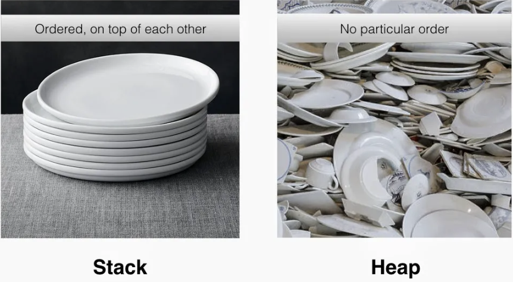

# The Rule of Five

In C++, when your class manages a resource like a file handle or a network socket, you become **responsible for its entire lifecycle**. The "Rule of Five" is a guideline that ensures you handle this responsibility correctly. It states that if you need to implement any of the **five special member functions**, you should probably implement all of them to guarantee your class **behaves predictably and safely**.

## Why is This Rule Necessary?

Understanding pointers requires a grasp of how memory is organized. The two primary regions are the **stack** and the **heap**:

### The Stack (Automatic & Orderly Memory)

Think of the stack like a stack of plates or a deck of cards. When you call a function, a new "plate" called a **stack frame** which is placed on top of the pile. This frame holds all the local variables and parameters for that function.

This process is fast, orderly, and most importantly, **automatic**. When the function finishes, its plate is immediately taken off the top, and all the memory it used is instantly freed. This is why local variables are sometimes called "automatic variables."

- **Automatic Management**: The compiler handles allocation and deallocation on the stack. Memory is allocated when a function is entered and automatically freed when the function returns. This is managed through a simple stack pointer that is incremented and decremented.

- **Fast Access:** Stack access is extremely fast because memory addresses are typically known at compile time, and the LIFO (Last-In, First-Out) structure allows for straightforward allocation and deallocation.

- **Limited Size**: The stack size is relatively small (compared to the heap) and fixed at compile time. The exact size can often be configured through compiler settings or operating system limits.

- **Stack Overflow**: Exceeding the stack's capacity (e.g., through excessively deep recursion or very large local variables) leads to a stack overflow error, usually causing program termination.

```c++
void myFunction() {
    int x = 10; // 'x' lives on the stack, in myFunction's "plate".
    // ... do stuff with x ...
} // When myFunction ends, its plate is removed. 'x' is automatically destroyed. No cleanup needed.
```

### Heap (Manual & Flexible Memory)

The heap is a large, less-structured pool of memory available for your program to use when you need data to live longer than a single function call or when its size isn't known at compile time.

Think of it as a large, open warehouse where you can request a storage space of any size. You request space using the new keyword, and you get back a pointer (an address) to your reserved spot.

- **Manual Control**: Unlike the stack, memory on the free store is not managed automatically. You are responsible for both allocation (`new`) and deallocation (`delete`).

- **Forgetting to `delete` causes Memory Leaks**: If you request memory with ne`w and forget to release it with `delete`, that memory becomes unusable for the rest of the program's duration. This is a **memory leak**.

- **Larger Size**: The free store is typically much larger than the stack, limited only by the available system memory.

- **Slower Access**: Allocation and deallocation are slower. The system has to search for a free block of the right size, which takes more time than simply moving the stack pointer.

- **Fragmentation**: Over time, as you allocate and deallocate blocks of different sizes, the free space in the "warehouse" can become broken up into small, non-contiguous chunks. This is called fragmentation, and it can make it difficult to find a large enough single block for a new allocation, even if there's enough total free space

The heap is used for dynamic memory allocation, and allows you to allocate memory explicitly during runtime. Unlike the stack, the heap does not automatically deallocate memory—you have to do it manually. If you forget to deallocate memory when you're done with it, it can lead to memory leaks. The heap is larger than the stack, but allocating and deallocating memory on the heap is slower than on the stack.

```c++
void createLeakyData() {
    // Request memory for 50 ints on the free store.
    int* myData = new int[50];
    // ... do stuff with myData ...

} // myData (the pointer on the stack) is destroyed, but the memory
  // it pointed to on the free store is NOT released! It's now leaked.
  // You should always use the delete keyword!
```



This is where the **special member functions** come in. They give you control over what happens when an object that manages a heap resource is **created**, **copied**, **moved**, or **destroyed**, allowing you to prevent memory leaks and other critical bugs.

## The Foundation: RAII (Resource Acquisition Is Initialization)

The guiding principle for resource management in C++ is **RAII**. It means that resource acquisition (like `new`) should happen in a constructor, and resource release (like `delete`) should happen in the destructor. This way, the resource's lifetime is tied to the object's lifetime, ensuring automatic cleanup when the object goes out of scope. Smart pointers and standard containers are powerful implementations of this principle.

## The Evolution: From the Rule of Three to the Rule of Five

Before C++11, the guideline was the **Rule of Three**. It covered the three essential functions for managing resources: a **destructor**, a **copy constructor** and a **copy assignment operator**.

### 1. Destructor (`~ClassName()`)

This is the most fundamental function for RAII. It's called automatically when an object's lifetime ends. Its job is to clean up.

- **Purpose**: To release any resources the object acquired. For dynamically allocated memory, this means calling `delete` or `delete[]`.
- **If you don't write one**: The compiler generates a default destructor, which does nothing for raw pointers. If your class created other resources with `new`, that memory will leak.

Code example: 

```c++
#include <cstring>
#include <iostream>

class Message {
public:
    explicit Message(const char* text = "")
        : text_(new char[strlen(text) + 1]) {
        strcpy(text_, text);
    }

    // 1. Destructor: Releases the allocated memory.
    ~Message() {
        std::cout << "Destructor freeing memory for: \"" << (text_ ? text_ : "") << "\"\n";
        delete[] text_;
    }

private:
    char* text_;
};
```

- **What it does**: The `delete[] text_;` line ensures that the memory allocated with new char[] in the constructor is returned to the free store, preventing a memory leak.

### 2.  Copy Constructor (`ClassName(const ClassName& other)`)

This is called when a new object is created as a copy of an existing one (e.g., `ClassName object1 = object2;`).

- **Purpose**: To create a **deep copy**. A deep copy means you allocate new memory for the new object and copy the contents of the original resource into it.
- **What it does**: Instead of just copying the pointer from other, it allocates fresh memory and copies the actual string data. Now, both Message objects have their own independent char* buffers.

#### Shallow vs. Deep Copy:

- **Shallow Copy (The Problem)**: When `object1` is destroyed, it deletes the memory. When `object2` is destroyed, it tries to delete the same memory again. This is a **double free** error and causes undefined behavior.
- **Deep Copy (The Solution)**: Each object manages its own independent resource.

Code example: 

```c++
// In the Message class...

// 2. Copy Constructor: Performs a deep copy.
Message(const Message& other) {
    std::cout << "Copy Constructor (deep copy)\n";
    // Allocate new memory for the copy.
    text_ = new char[strlen(other.text_) + 1];
    // Copy the content from the source object.
    strcpy(text_, other.text_);
}
```

- **If you don't write one**: The compiler-generated version performs a shallow copy. It just copies the pointer data. Now both objects point to the same memory. This is a disaster waiting to happen.

### 3. Copy Assignment Operator (`ClassName& operator=(const ClassName& other)`)

This is called when you assign an existing object to another existing object (e.g., `object1 = object2;`)

- **Purpose**: This function makes an existing object a deep copy of another existing object. It must handle cleaning up its old resource and protecting against self-assignment. The copy-and-swap idiom is a robust way to implement this.
- **If you don't write one**: The default version performs a shallow copy, leading to the same double-free problems and also leaking the memory the object was originally managing.

Code example: 

```c++
#include <utility> // For std::swap

// In the Message class...

// 3. Copy Assignment Operator
Message& operator=(const Message& other) {
    std::cout << "Copy Assignment (deep copy)\n";
    // Check for self-assignment (e.g., msg1 == msg1;)
    if (this != &other) {
        // 1. Create a temporary copy (uses the copy constructor).
        Message temp(other);
        // 2. Swap the contents of this object with the temporary copy.
        std::swap(text_, temp.text_);
    }
    // 3. The temporary 'temp' is destroyed here, and its destructor
    //    cleans up our old 'text_'.
    return *this;
}
```

- **What it does**: This safely replaces the current object's content with a copy of the other's content, correctly managing memory throughout the process.

### 4. Move Constructor (`ClassName(ClassName&& other) noexcept`)

> [!NOTE]
> C++11 introduced move semantics to avoid expensive copies when dealing with temporary objects (rvalues). This expanded the Rule of Three into the Rule of Five.

This function efficiently creates a new object by "stealing" the resource from a temporary (rvalue) object, avoiding an expensive deep copy.

- **Purpose**: Move operations are significantly faster than copy operations for objects that manage large resources because they simply transfer ownership of the resource instead of performing a deep copy.
- **How it works**: It performs a shallow copy of the pointer and then nullifies the source pointer. This is a very fast operation that just involves moving an address, not allocating and copying large amounts of data.

Code example: 

```c++
// In the Message class...

// 4. Move Constructor: Steals the resource.
Message(Message&& other) noexcept
    : text_(other.text_) { // 1. Copy the pointer from the source.
    std::cout << "Move Constructor (stealing resources)\n";
    // 2. Set the source's pointer to null to prevent it from
    //    deleting the resource we just stole.
    other.text_ = nullptr;
}
```

- **Why `noexcept`?**: Move operations should be marked noexcept (meaning they don't throw exceptions). This allows the standard library to use them for strong exception safety guarantees in containers like `std::vector`.

### 5. Move Assignment Operator (`ClassName& operator=(ClassName&& other) noexcept`)

- **Purpose**: To release the existing object's resource and steal the resource from a temporary object.

Code example: 

```c++
// In the Message class...

// 5. Move Assignment Operator: Steals the resource.
Message& operator=(Message&& other) noexcept {
    std::cout << "Move Assignment (stealing resources)\n";
    if (this != &other) {
        // 1. Delete our own existing resource.
        delete[] text_;
        // 2. Steal the pointer from the source object.
        text_ = other.text_;
        // 3. Nullify the source pointer.
        other.text_ = nullptr;
    }
    return *this;
}
```

- **What it does**: It safely releases its current resource and then takes ownership of the resource from the temporary object, which is much more efficient than performing a deep copy.

## A Complete `Message` Class Example

Let's illustrate the Rule of Five with a simple class that holds a C-style string on the heap.

**message.h:**

```c++
#include <cstddef>

class Message {
public:
    explicit Message(const char* text = "");

    // 1. Destructor
    ~Message();

    // 2. Copy Constructor
    Message(const Message& other);

    // 3. Copy Assignment Operator
    Message& operator=(const Message& other);

    // 4. Move Constructor
    Message(Message&& other) noexcept;

    // 5. Move Assignment Operator
    Message& operator=(Message&& other) noexcept;

    void print() const;

private:
    char* text_;
};
```

**message.cpp**:

```c++
#include "Message.h"
#include <iostream>
#include <cstring> // For strlen, strcpy

Message::Message(const char* text) {
    std::cout << "Constructor called for: \"" << text << "\"\n";
    text_ = new char[strlen(text) + 1];
    strcpy(text_, text);
}

// 1. Destructor
Message::~Message() {
    std::cout << "Destructor called for: \"" << (text_ ? text_ : "") << "\"\n";
    delete[] text_;
}

// 2. Copy Constructor (Deep Copy)
Message::Message(const Message& other) {
    std::cout << "Copy Constructor called for: \"" << other.text_ << "\"\n";
    text_ = new char[strlen(other.text_) + 1];
    strcpy(text_, other.text_);
}

// 3. Copy Assignment Operator (using copy-and-swap)
Message& Message::operator=(const Message& other) {
    std::cout << "Copy Assignment called for: \"" << other.text_ << "\"\n";
    if (this != &other) {
        Message temp(other);
        std::swap(text_, temp.text_);
    }
    return *this;
}

// 4. Move Constructor (Stealing)
Message::Message(Message&& other) noexcept : text_(other.text_) {
    std::cout << "Move Constructor called for: \"" << other.text_ << "\"\n";
    other.text_ = nullptr; // Leave moved-from object in a valid state
}

// 5. Move Assignment Operator (Stealing)
Message& Message::operator=(Message&& other) noexcept {
    std::cout << "Move Assignment called for: \"" << other.text_ << "\"\n";
    if (this != &other) {
        delete[] text_;
        text_ = other.text_;
        other.text_ = nullptr;
    }
    return *this;
}

void Message::print() const {
    std::cout << "Message: " << (text_ ? text_ : "empty") << std::endl;
}
```

**main.cpp**:

```c++
#include "Message.h"
#include <vector>

Message createMessage() {
    return Message("Temporary Message");
}

int main() {
    Message hello("Hello"); // Constructor

    Message copyOfHello = hello; // Copy Constructor

    Message anotherMessage("Another");
    anotherMessage = hello; // Copy Assignment

    Message movedMessage = createMessage(); // Move Constructor

    Message finalMessage;
    finalMessage = Message("Another Temporary"); // Move Assignment

    return 0;
}
```

## The Rule of Zero

The Rule of Zero is the modern best practice that you should strive for. It states that a class should not need to declare any of the five special member functions.

You achieve this by not managing raw pointers or resources yourself. Instead, you compose your class using other types that already manage their resources correctly (i.e., they already follow the Rule of Five). The most common tools for this are standard library containers and smart pointers.

Let's rewrite our `Message` class using `std::string`. The `std::string` class already handles all memory management, copying, moving, and destruction internally.

```c++
#include <string>
#include <iostream>

class Message {
    // No destructor, copy/move constructors or assignment operators needed!
    // The compiler will generate them, and they will do the right thing
    // by calling the corresponding functions on the std::string member.
public:
    explicit Message(const std::string& text = "") : text_(text) {}
    void print() const { std::cout << "Message: " << text_ << std::endl; }
private:
    std::string text_;
};
```

That's it! This class is now complete and correct. The compiler-generated special functions will automatically and correctly copy, move, and destroy the `std::string` member, which in turn manages the underlying memory perfectly. By following the Rule of Zero, your code becomes simpler, safer, and much less error-prone.

## Best Practices: When You Don't Implement Everything

todo

talk about default & delete
